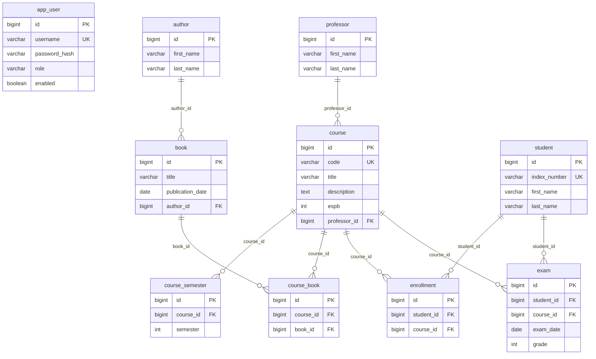

# Database schema (Course Record)

This document mirrors the JPA model under `com.example.courserecord.entity` and the **Liquibase** changelog. On GitHub, the diagram below renders as graphics; in other viewers, use a [Mermaid](https://mermaid.js.org/) preview or copy the block into the [Mermaid Live Editor](https://mermaid.live/).

## Entity–relationship diagram

## Relationships (summary)

| From | To | Cardinality | FK / join |
|------|----|----------------|-----------|
| `book` | `author` | N : 1 | `book.author_id` → `author.id` (nullable) |
| `course` | `professor` | N : 1 | `course.professor_id` → `professor.id` (nullable) |
| `course_semester` | `course` | N : 1 | `course_semester.course_id` → `course.id` |
| `course_book` | `course` | N : 1 | `course_book.course_id` → `course.id` |
| `course_book` | `book` | N : 1 | `course_book.book_id` → `book.id` |
| `enrollment` | `student` | N : 1 | `enrollment.student_id` → `student.id` |
| `enrollment` | `course` | N : 1 | `enrollment.course_id` → `course.id` |
| `exam` | `student` | N : 1 | `exam.student_id` → `student.id` |
| `exam` | `course` | N : 1 | `exam.course_id` → `course.id` |
| `app_user` | — | — | No foreign keys (authentication only) |

## Unique constraints (business rules)

| Table | Constraint name | Columns |
|-------|-----------------|---------|
| `course` | (implicit / Liquibase) | `code` unique |
| `student` | (implicit / Liquibase) | `index_number` unique |
| `app_user` | (implicit / Liquibase) | `username` unique |
| `course_semester` | `uk_course_semester_course_semester` | (`course_id`, `semester`) |
| `course_book` | `uk_course_book_course_book` | (`course_id`, `book_id`) |
| `enrollment` | `uk_enrollment_student_course` | (`student_id`, `course_id`) |
| `exam` | `uk_exam_student_course` | (`student_id`, `course_id`) |

`course_semester.semester` is also checked in the database to be between **1** and **8** (study-program semester ordinals).

## Source of truth

- **Java:** `src/main/java/com/example/courserecord/entity/*.java`
- **Migrations:** `src/main/resources/liquibase/mysql/`
